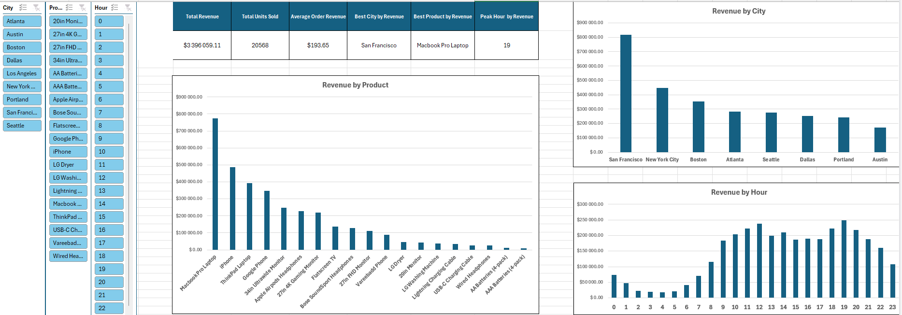
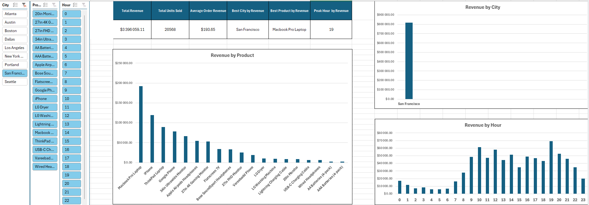
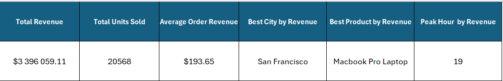
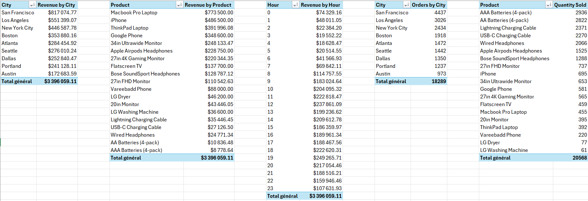

# Excel Sales Dashboard

Interactive sales analysis dashboard built with Microsoft Excel using the April 2019 sales dataset from Kaggle.

This project simulates a real-world business reporting workflow commonly found in junior Data Analyst and Business Intelligence positions.

The objective of this project is to transform raw transactional sales data into actionable business insights using Excel, Power Query, Pivot Tables, KPI calculations, and interactive dashboards.

---

# Technologies Used

* Microsoft Excel 365
* Power Query
* Pivot Tables
* Pivot Charts
* Slicers
* Excel Formulas

---

# Project Workflow

The project follows a complete analytical workflow:

1. Import raw CSV sales data
2. Clean and transform data with Power Query
3. Create business-oriented calculated columns
4. Build Pivot Tables for aggregation
5. Calculate KPIs using Excel formulas
6. Create interactive charts
7. Build a dashboard with slicers and KPI cards
8. Generate business insights through reporting

---

# Dataset Cleaning

The raw dataset contained:

* empty rows,
* missing values,
* inconsistent formatting,
* non-normalized date formats.

The cleaning process included:

* filtering invalid rows,
* converting data types,
* handling missing values,
* creating a structured analytical dataset.

---

# Feature Engineering

The dataset was enriched with business-oriented analytical columns:

* Revenue
* Month
* Hour
* City

These transformations were implemented using Power Query.

---

# Excel Concepts Used

This project covers both fundamental and advanced Excel concepts.

## Data Preparation

* Power Query
* Data cleaning
* Data type conversion
* Custom columns

## Data Analysis

* Pivot Tables
* Pivot Charts
* KPI calculations
* Business reporting

## Advanced Excel Functions

* XLOOKUP (RECHERCHEX)
* UNIQUE
* GROUPBY (GROUPER.PAR)
* SORT (TRIER)
* SUM (SOMME)
* SUMIF (SOMME.SI)
* MAX
* COUNTA (NBVAL)

## Dashboarding

* Interactive slicers
* KPI cards
* Dynamic filtering
* Business-oriented visualizations

---

# KPIs

The dashboard includes key business metrics such as:

* Total Revenue
* Total Units Sold
* Average Order Value
* Best City by Revenue
* Best Product by Revenue
* Peak Hour by Revenue

---

# Dashboard Features

The dashboard provides:

* interactive filtering by city,
* interactive filtering by product,
* interactive filtering by hour,
* revenue analysis by city,
* revenue analysis by product,
* revenue analysis by hour,
* business KPI reporting.

---

# Project Structure

```text
excel-sales-dashboard/
│
├── data/
│   └── Sales_April_2019.csv
│
├── screenshots/
│   ├── dashboard_overview.png
│   ├── dashboard_filtered_city.png
│   ├── kpi_cards.png
│   └── pivot_tables.png
│
├── .gitignore
├── README.md
└── SalesDashboard.xlsx
```

---

# Example Screenshots

## Dashboard Overview

Complete dashboard view with KPIs, charts, and slicers.



---

## Interactive Filtering

Example dashboard filtered on a specific city using slicers.



---

## KPI Cards

Overview of the main business KPIs.



---

## Pivot Tables

Underlying analytical Pivot Tables used for reporting.



---

# Business Insights

The dashboard helps identify:

* the cities generating the highest revenue,
* the products contributing the most to sales,
* peak sales hours,
* customer purchasing behavior,
* overall business performance.

These insights can support:

* sales optimization,
* inventory management,
* marketing campaigns,
* operational planning.

---

# Future Improvements

Possible future improvements include:

* Power BI integration,
* SQL integration,
* automated reporting,
* advanced forecasting,
* customer segmentation.

---

# Learning Objectives

This project was built to practice:

* Excel business reporting,
* Power Query workflows,
* KPI calculation,
* dashboard design,
* Pivot Table analysis,
* interactive reporting,
* business-oriented data analysis.

---
